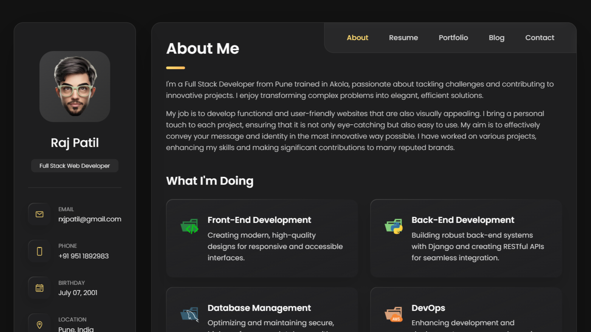
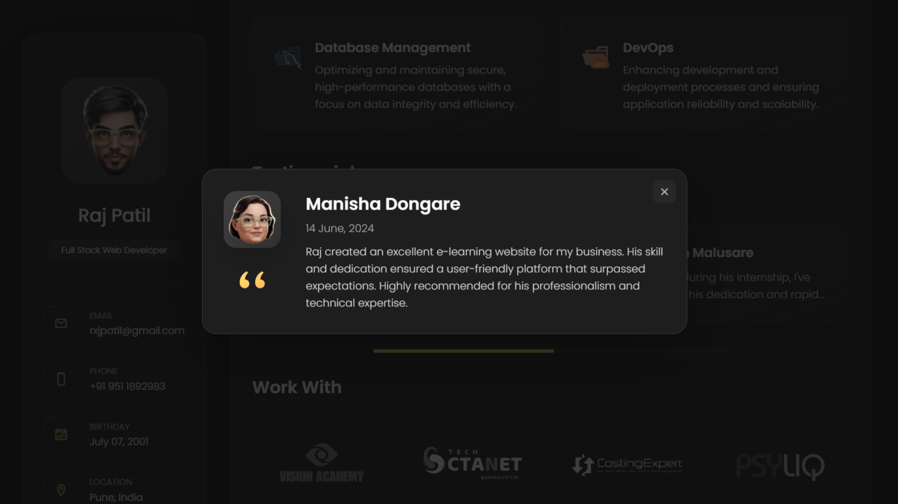
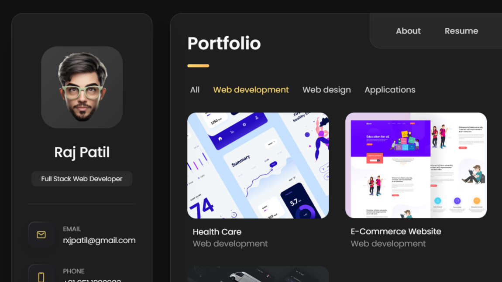
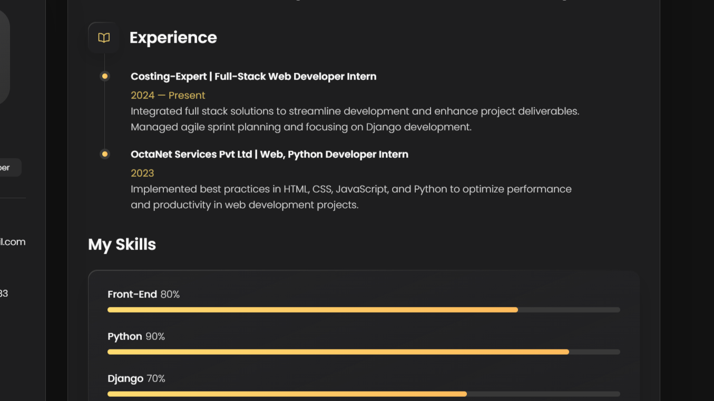

# Raj G Patil's Portfolio

Welcome to my personal portfolio repository! This project showcases my skills, projects, and experience as a full-stack developer.

## Table of Contents
- [About](#about)
- [Technologies Used](#technologies-used)
- [Sample Work](#sample-work)
- [Contact](#contact)

## About
I am a full-stack developer with experience in Python, MySQL, HTML, CSS, JavaScript, Django, Git, and Bootstrap. I have completed various internships and worked on several projects, gaining expertise in web development and software engineering.

## Technologies Used
- **Frontend:** HTML, CSS, Bootstrap
- **Backend:** JavaScript
- **Version Control:** Git

## Sample Work
Here are some sample images from my projects:

## Contact
Feel free to reach out to me for any queries or opportunities.

- **Email:** [rxjpatil@gmail.com](mailto:rxjpatil@gmail.com)
- **LinkedIn:** [LinkedIn Profile](https://www.linkedin.com/in/rxjpatil/)
- **GitHub:** [GitHub Profile](https://github.com/rxjpatil)

Thank you for visiting my portfolio repository!
